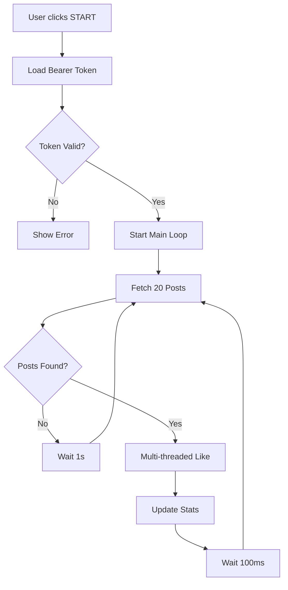

# 🔥 Sora Auto Liker - Aggressive Mode

Automatically like Sora posts at maximum speed with multi-threaded aggressive mode.


## 🌍 Supported Languages (15 Languages)

- 🇬🇧 English
- 🇹🇷 Türkçe (Turkish)
- 🇨🇳 中文 (Chinese Simplified)
- 🇪🇸 Español (Spanish)
- 🇷🇺 Русский (Russian)
- 🇧🇷 Português (Portuguese)
- 🇯🇵 日本語 (Japanese)
- 🇰🇷 한국어 (Korean)
- 🇫🇷 Français (French)
- 🇩🇪 Deutsch (German)
- 🇮🇹 Italiano (Italian)
- 🇸🇦 العربية (Arabic)
- 🇮🇳 हिन्दी (Hindi)
- 🇳🇱 Nederlands (Dutch)
- 🇵🇱 Polski (Polish)

## ✨ Features

- ✅ **Multi-language Support** - 15 languages built-in
- ✅ **Aggressive Mode** - Maximum speed operation
- ✅ **Multi-threaded** - Parallel like requests
- ✅ **Zero Delays** - Continuous operation (100ms minimum)
- ✅ **Cloudflare Bypass** - Works directly in browser
- ✅ **Auto Token Detection** - Automatic or manual token setup
- ✅ **Live Statistics** - Real-time likes and errors tracking
- ✅ **Background Operation** - Works even when popup is closed

## 📦 Installation

### Step 1: Download Extension

1. Download or clone this repository
2. Extract to `sora-extension` folder

### Step 2: Install in Chrome

1. Open Chrome/Edge
2. Go to `chrome://extensions/`
3. Enable **Developer mode** (top right)
4. Click **Load unpacked**
5. Select the `sora-extension` folder
6. Done! Extension is installed ✅

### Step 3: (Optional) Add Icons

For better visuals, convert `icon.svg` to PNG:

1. Go to https://cloudconvert.com/svg-to-png
2. Upload `icon.svg`
3. Create 3 sizes:
   - 16x16 → Save as `icon16.png`
   - 48x48 → Save as `icon48.png`
   - 128x128 → Save as `icon128.png`
4. Place all PNGs in `sora-extension` folder

## 🎮 How to Use

### Quick Start (3 Steps)

1. **Open Sora**
   - Go to https://sora.chatgpt.com
   - Login to your account

2. **Get Bearer Token**
   
   **Method 1: Auto Find (Easiest)**
   - Open extension popup
   - Click **🔍 Auto Find** button
   - Scroll on Sora page
   - Token will be detected automatically
   
   **Method 2: Manual (Recommended)**
   - Press `F12` on Sora.chatgpt.com
   - Go to **Network** tab
   - Scroll on the page
   - Click on any `feed` request
   - Find **Request Headers** section
   - Copy the **authorization** value
   - Paste in extension (include "Bearer " or not, both work)
   - Click **💾 Save**

3. **Start Liking**
   - Click **🔥 START** button
   - Bot will run continuously
   - Check stats in real-time
   - Click **⏹️ STOP** to stop

### Settings

| Setting | Description | Recommended |
|---------|-------------|-------------|
| **Minimum Delay** | Delay between likes (milliseconds) | 100-500ms |
| **Batch Size** | Posts to fetch per cycle | 20 (max) |

## 🌍 Changing Language

1. Open extension popup
2. Click language dropdown (top)
3. Select your language
4. UI updates instantly

## 📊 Understanding Statistics

- **Total Likes**: Number of posts liked since last reset
- **Errors**: Failed requests or issues
- **🔄 Reset**: Clear all statistics

## 🔧 Troubleshooting

### "Token not found"
**Solution**: 
1. Go to Sora and scroll
2. Click **🔍 Auto Find** again
3. Or manually copy token from F12 > Network

### "Sora.chatgpt.com not open"
**Solution**: 
- Keep Sora tab open
- Refresh the page (F12)

### "Token invalid" / 401 Error
**Solution**:
- Logout and login to Sora
- Get new token
- Paste and save

### Extension not working
**Solution**:
1. Go to `chrome://extensions/`
2. Click **🔄 Reload** on extension
3. Refresh Sora page
4. Try again

### Bot stops after some time
**Possible causes**:
- Rate limited by Sora (too many requests)
- Token expired
- Network issue

**Solution**: Wait 5-10 minutes, get new token if needed

## ⚙️ Advanced Configuration

### Delay Settings

- **0-100ms**: VERY AGGRESSIVE ⚡⚡⚡ (High ban risk)
- **100-500ms**: AGGRESSIVE ⚡⚡ (Moderate risk)
- **500-2000ms**: NORMAL ⚡ (Safer)
- **2000ms+**: SAFE ✅ (Recommended for long-term use)

### Batch Size

- **20**: Maximum (fetches most posts per cycle)
- **10-15**: Balanced
- **5-8**: Conservative

## ⚠️ Important Warnings

### Risk of Ban
This extension is **VERY AGGRESSIVE**. Using it may result in:
- ❌ Temporary rate limiting
- ❌ Account suspension
- ❌ Permanent ban

**Use at your own risk!**

### Ethical Use
- Don't abuse the system
- Respect content creators
- Use reasonable delays
- Only like content you actually want to support

### Legal Disclaimer
This tool is for **educational purposes only**. The developers are not responsible for:
- Any account bans or restrictions
- Violation of Sora's Terms of Service
- Misuse of the extension
- Any damages or losses

**YOU USE THIS AT YOUR OWN RISK**

## 🛠️ Development

### Project Structure

```
sora-extension/
├── manifest.json          # Extension configuration
├── popup.html             # UI interface
├── popup.js               # UI logic  
├── background.js          # Main bot engine (aggressive mode)
├── content.js             # Sora API integration
├── i18n.js                # Multi-language support (15 languages)
├── icon.svg               # Icon source
├── icon16.png             # 16x16 icon
├── icon48.png             # 48x48 icon
├── icon128.png            # 128x128 icon
└── README.md              # This file
```

### How It Works



### Algorithm

1. **Infinite Loop**: Runs continuously until stopped
2. **Batch Fetching**: Gets 20 posts per request
3. **Parallel Processing**: All likes happen simultaneously using `Promise.all()`
4. **Minimal Delay**: Only 100ms between cycles
5. **Error Handling**: Continues even if some requests fail

### Key Technologies

- **Chrome Extensions API**: For browser integration
- **Fetch API**: For HTTP requests
- **Promise.all()**: For parallel operations
- **localStorage**: For settings persistence
- **CSS Animations**: For fire effects 🔥

## 🤝 Contributing

Found a bug? Want to add a feature?

1. Fork the repository
2. Create your feature branch
3. Commit your changes
4. Push to the branch
5. Open a Pull Request

### Adding More Languages

Edit `i18n.js` and add new language object:

```javascript
sv: {  // Swedish
  extName: "Sora Auto Gillare",
  aggressiveMode: "AGGRESSIVT LÄGE - MAXIMAL HASTIGHET",
  // ... rest of translations
}
```

## 📝 Changelog

### Version 2.0 (Current)
- ✅ Added 15 language support
- ✅ Aggressive mode with multi-threading
- ✅ Zero-delay continuous operation
- ✅ Auto token detection
- ✅ Live statistics
- ✅ Improved UI with fire animations

### Version 1.0
- Initial release
- Basic auto-like functionality

## 🔒 Privacy

This extension:
- ✅ Does NOT collect any personal data
- ✅ Does NOT send data to external servers
- ✅ Only communicates with sora.chatgpt.com
- ✅ Stores settings locally in your browser
- ✅ Open source - you can review all code

## 📞 Support

Having issues?

1. Check [Troubleshooting](#-troubleshooting) section
2. Review the code (it's open source!)
3. Open an issue on GitHub

## ⭐ Show Your Support

If this extension helped you:
- ⭐ Star the repository
- 🐛 Report bugs
- 💡 Suggest features
- 📢 Share with friends (responsibly!)

## 📜 License

MIT License - Use at your own risk

**Remember**: This is an educational project. Using automation tools may violate Sora's Terms of Service. Always use responsibly and ethically.

---

**Made with ❤️ and 🔥 for Sora users worldwide**

**Use responsibly. Like genuinely. Support creators.**

🌍 Available in 15 languages | ⚡ Maximum Speed | 🔥 Aggressive Mode
